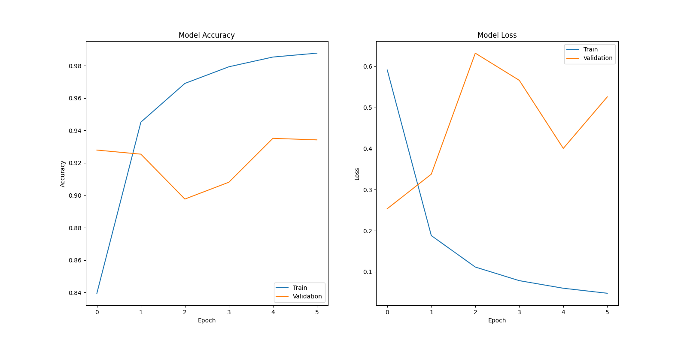
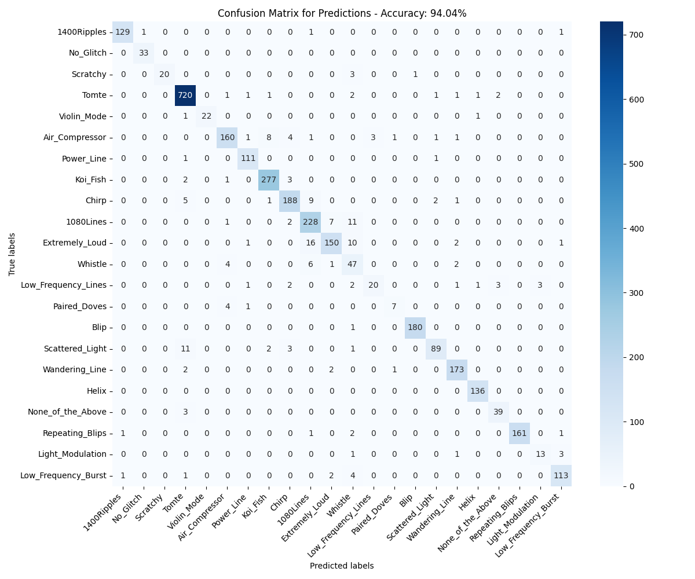

# PyWaveCNN

## Overview

PyWaveCNN is an advanced convolutional neural network (CNN) project, leveraging TensorFlow to analyse and categorise various types of gravitational wave data represented in contour plots. The project aims to facilitate the understanding and classification of these gravitational wave forms using machine learning techniques.

## Technical Features

- **TensorFlow and Keras Integration:** PyWaveCNN is built using TensorFlow and its high-level API, Keras. This integration enables efficient modeling and training of the CNN.
- **Convolutional Neural Network Implementation:** Utilising layers like `MaxPooling2D` and `Conv2D`, the project creates a CNN capable of extracting features from contour plots of gravitational waves.
- **Model Optimisation:** The project employs the `RMSProp` optimiser from Keras.

## Machine Learning Models

PyWaveCNN uses a custom-built CNN model designed specifically for the task of gravitational wave classification. The model includes several convolutional layers, max pooling layers, and dense layers, culminating in a softmax layer for multi-class classification.

## File Description

- `main.py`: The main script orchestrating the machine learning workflow, including data preprocessing, model training, and performance evaluation.
- `models.py`: Contains the CNN model's architecture and configuration.
- `plotter.py`: Manages the creation and rendering of plots derived from model performance and data analysis.

## Output

The model processes gravitational wave data, offering insightful visualisations and performance metrics:

- **Data Visualisation:** The data can be visualised to show different types of gravitational waves, aiding in understanding the dataset complexity.
  
  

- **Model Performance Metrics:** Displays the accuracy and loss metrics over training epochs, offering insights into model convergence and overfitting.
  
  

- **Confusion Matrix:** Evaluates the model's predictive performance on unseen data, illustrating its precision and recall capabilities.
  
  

## Acknowledgements

[Machine learning for Gravity Spy: Glitch classification and dataset](https://zenodo.org/records/1476156)